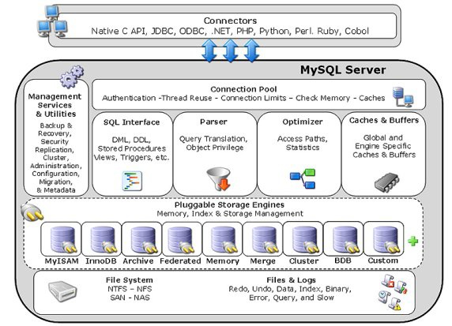

---
layout:     post
title:      MySQL学习笔记（一）
subtitle:   
date:       2020-09-27
author:     BY Jady
header-img: img/post-bg-2015.jpg
catalog: true
tags:
    - Mysql
    - 数据库
--- 

# MySQL的架构

## 架构图

## 组成部分

### Connectors
连接器，对外交互组件，是数据库服务和应用服务的连接的向导或桥梁
### Management Service & Utilities
管理服务和工具，包括备份&恢复、安全、复制、数据迁移等
### Connection Pool
连接池，负责监听客户端请求，接收和转发到目标模块，每个连接到服务器的客户端都有一个线程负责通信
### SQL Interface
SQL接口，用于接收SQL语言，如DDL,DML,Stored Procedures,Views,Triggers等
### Parser
分析器/解析器，解析SQL语句，进行词法分析，检查语法合法性
### Optimizer
优化器，对SQL命令进行优化分析，如对索引的选择，表的连接顺序的选择等
### Caches & Buffers
缓存和缓冲组件
### Pluggable Storage Engines Memory,Index & Storage Management
存储引擎，对数据的存储，检索，管理的实现
### File System
文件系统
### Files & logs
日志文件

## 常见的存储引擎
### 几种典型的存储引擎的特性对比（8.0）
|  特性  | MyISAM   | Memory | InnoDB | Archive | NDB |
|:--------|:-------:|--------:|:--------|:-------:|--------:|
| 存储限制  | 256TB | RAM | 64TB | 无 | 384EB |
| 事务支持  | 不支持  | 不支持 | 支持 | 不支持 | 支持 |
| 锁定粒度  | 表  | 表 |行 | 行 | 行 |
|多版本并发控制MVCC  | 不支持 | 不支持 |支持 | 不支持 | 不支持 |
|B+树索引  | 支持 | 支持 |支持 | 不支持 | 不支持 |
|备份/时间点恢复（注释1） | 支持 | 支持 |支持 | 支持 | 支持 |
|集群数据库支持  | 不支持 | 不支持 |不支持 | 不支持 | 支持 |
|聚簇索引  | 不支持 | 不支持 |支持 | 不支持 | 不支持 |
|压缩数据  | 支持（注释2） | 不支持 |支持 | 支持 | 不支持 |
|数据缓存  | 不支持 | 不支持 |支持 | 不支持 | 支持 |
|加密数据  | 支持（注释3） | 支持（注释3）|支持（注释4） | 支持 （注释3）| 支持（注释3） |
|外键支持  | 不支持 | 不支持 |支持 | 不支持 | 支持（注释5） |
|全文搜索索引  | 支持 | 不支持 |支持（注释6） | 不支持 | 不支持 |
|地理空间数据类型支持  | 支持 | 不支持 |支持 | 支持 | 支持 |
|地理空间索引支持  | 支持 | 不支持 |支持（注释7）| 不支持 | 不支持 |
|哈希索引  | 不支持 | 支持 |不支持（注释8）| 不支持 | 支持 |
|索引缓存  | 支持 | 不支持 |支持| 不支持 | 支持 |
|复制支持（注释1）  | 支持 | 有限支持（注释9） |支持| 支持 | 支持 |
|T树索引  | 不支持 | 不支持 |不支持| 不支持 | 支持 |
|更新数据字典的统计信息  | 支持 | 支持 |支持| 支持 | 支持 |

